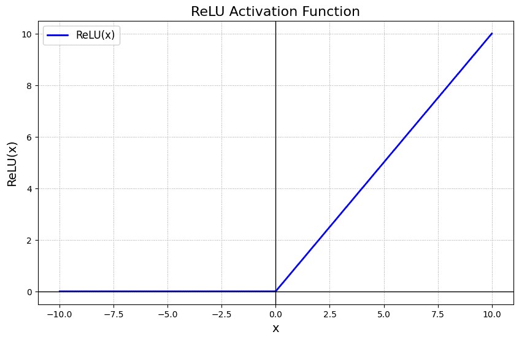

# Scam Email Filter

## Machine Learning

The machine learning model is a neural network created using the PyTorch framework. The model is trained on a dataset of scam and legitimate emails.

### Dataset Preparation

The email features, meaning the email content, are converted into [TF-IDF](#tf-idf-term-frequency-inverse-document-frequency) numerical representations. They are then converted into tensors. We use TF-IDF over word count is because getting the total number of word count does not give much information about the email. Scam emails tend to have certain words and TF-IDF weights each word differently; scam words tend to have higher weights.

The emails are given a label depending on whether they are scams or not:

- `1`: scam
- `0`: legitimate

The labels are 1D arrays, while the email features are 2D arrays (number of emails, number of words/features). Because of this, an extra dimension is added to the labels to match the email features array.

<details>
<summary><strong>TF-IDF (Term Frequency-Inverse Document Frequency)</strong></summary>

TF-IDF is a numerical statistic that reflects how important a word is to a document in a collection or corpus.

**Term Frequency (TF):** Measures how frequently a term appears in a document.

$$TF(t,\ d) = \frac{\text{Number of times term } t \text{ appears in } d}{\text{Total number of terms in } d}$$

**Inverse Document Frequency (IDF):** Measures how important a term is across the corpus.

$$IDF(t,\ D) = \log\left(\frac{\text{Total documents in } D}{\text{Documents containing term } t}\right)$$

**Combined score:**

$$TF\text{-}IDF(t,\ d,\ D) = TF(t,\ d) \times IDF(t,\ D)$$

**Source:** GeeksforGeeks — [Understanding TF-IDF](https://www.geeksforgeeks.org/machine-learning/understanding-tf-idf-term-frequency-inverse-document-frequency/)

</details>

### Neural Network Architecture

The neural network is made up of 3 layers.

**Layer 1:** Converts TF-IDF vectors to 256-dimensional vectors.

The converted 256-dimensional vectors are multiplied by weights and then added together. The weights start as random values and slowly adjust as the model is trained. The results of the first layer are fed into a [ReLU](#relu-rectified-linear-unit) function.

Afterwards, dropout is applied to the neural network, which randomly excludes 30% of neurons. This prevents the model from overfitting and reduces over-reliance on certain neurons.

**Layer 2:** Same as layer 1, but converts 256-dimensional vectors to 64-dimensional vectors.

**Layer 3:** Same as layers 1 and 2, but converts 64-dimensional vectors to 1-dimensional vectors.

The final number is fed into a Sigmoid function, which turns the number into a probability between 0 and 1. We use the Sigmoid function because it converts the numbers into a probability between 0 and 1. A value of 0 is least likely to be a scam, and a value of 1 is most likely to be a scam.

<details>
<summary><strong>ReLU (Rectified Linear Unit)</strong></summary>

ReLU is an activation function applied after each layer. It turns any negative number to 0 and leaves positive numbers unchanged. This lets the network learn non-linear patterns.

$$ReLU(x) = \max(0,\ x)$$

For any input below 0, the output is 0. For any input above 0, the output equals the input. This allows the model to learn non-linear patterns since all negative numbers are turned into 0.



**Source:** GeeksforGeeks — [ReLU Activation Function in Deep Learning](https://www.geeksforgeeks.org/deep-learning/relu-activation-function-in-deep-learning/)

</details>

### Training Process

The hyperparameters are set to the following values:

- Epochs: 10 (number of times the model sees the entire dataset)
- Batch size: 64 (number of emails the model processes at once)
- Learning rate: 0.001 (how much the model adjusts the weights each time)
- Max features: 10,000 (how many words the model will track)

The dataset is split into 3 sets: train, validation, and test. This prevents the model from memorizing the dataset. The train set is used to train the model, the validation set is used to evaluate the model, and the test set is used to test the model and see its accuracy.

The loss function is Binary Cross Entropy Loss. This measures the difference between the predicted probability and the actual label. A loss of 0 means the model is perfect. A higher loss means the model is wrong. Then backpropagation occurs, where weights are adjusted to reduce loss.

Adam optimizer is used to update the weights. We use Adam because our model does not need much tuning, and Adam is able to quickly adjust to the loss.

The outputs are saved to `ml/vectorizer.json` for the vocabulary vectorizer and `ml/model.pt` for the trained model. The vectorizer is saved as JSON so the app does not need to load a pickle file at runtime. Older versions used `vectorizer.pkl`, but the current prediction code uses `vectorizer.json`.

### Evaluation

We use the held-out test set that the model has not seen during training or validation to evaluate its performance. The model gets scored on three main metrics:

- Precision: Measures the proportion of positive identifications that were actually correct. High precision means the model rarely flags legitimate emails as scams.
- Recall: Measures the proportion of actual positives that were correctly identified. High recall means the model catches most of the actual scams.
- F1 score: The harmonic mean of precision and recall, providing a single score that balances both.

The F1 score of the model currently sits at 0.9655.

### Prediction Threshold

The model outputs a probability between 0 and 1. The app only marks an email as a scam when the probability is at least `0.85`. This higher threshold helps reduce false positives, which means fewer legitimate emails get marked as scams.

The dashboard also uses three risk tags:

- `Legit`: The email is treated as safe.
- `Possible scam`: The email has suspicious signals, but is not strong enough to label as a scam.
- `Scam`: The email is treated as a confirmed scam and can receive the Gmail scam label.

Users can also correct the model from the dashboard. Each email row has controls to mark the email as `Legit`, `Possible scam`, or `Scam`. This saves a manual risk override, so the dashboard, stats, and reports use the corrected label instead of only trusting the model output.

Risk corrections update the dashboard immediately, then sync to the backend in the background. This keeps the interface responsive while still preserving the correction in the database.

## Backend

Django is used as the backend for this project. Its uses consist of:

1. Models: Defines the data models for where to store and retrieve data, such as emails, labels, and login credentials.
2. Views: Handles the REST API calls from the frontend, such as getting the email contents or applying a label.
3. URLs: Delegates requests to the correct view.

### OAuth

The app uses OAuth to access the user's Gmail account. This allows the user to grant the app permission to access their emails without giving away their Gmail password.

When the user connects their Gmail account, the app redirects them to the Google permission screen to allow access to their emails. Then Google redirects the user back to the app with a temporary authorization code. The backend exchanges this temporary code for an access token and a refresh token.

The access token is used to access the user's email. The refresh token is used to get new access tokens when the current access token expires. The refresh and access tokens are stored locally in `token.json`.

#### App Scopes

- `https://www.googleapis.com/auth/gmail.readonly`: Allows the app to read the user's emails.
- `https://www.googleapis.com/auth/gmail.labels`: Allows the app to read and manage Gmail labels.
- `https://www.googleapis.com/auth/gmail.modify`: Allows the app to modify Gmail messages, such as applying labels.

#### Callback Routes

1. `/auth/gmail/`: Starts the OAuth login flow and redirects the user to Google.
2. `/auth/callback/`: Receives the response from Google after the user approves access, exchanges the authorization code for tokens, and saves them in `token.json`.

#### Redirect URL

The redirect URL is:

`http://localhost:8000/auth/callback/`

### Models

The models are stored in a local SQLite database. The database schema is defined in `dashboard/models.py`.

#### Email Record

Stores the result of scanning one Gmail message through the ML model.

- `id`: The id of the email
- `subject`: Email subject
- `sender`: User that sent the email
- `snippet`: Snippet of the email content
- `received_at`: Time email was received in the user's inbox
- `confidence`: Confidence level of the model; 1 being most likely to be a scam and 0 being least likely to be a scam
- `is_scam`: Whether the email is a scam (T/F)
- `labeled_in_gmail`: Whether the email contains the scam tag (T/F)
- `scanned_at`: Time when the email was scanned by our system
- `reasons`: List of reasons why the email was flagged as a scam. ex: "Urgency tactic", "Credential request", "Cash incentive", "Lookalike domain", "Suspicious link", "Crypto/investment"
- `risk_level`: API-only risk tag used by the frontend. Values are `legit`, `possible_scam`, or `scam`
- `risk_label`: Human-readable version of the risk tag. Values are `Legit`, `Possible scam`, or `Scam`
- `user_risk_override`: Manual correction selected by the user when the model is wrong

#### Scan Settings

Stores the global settings for the app.

- `scan_window_days`: How many days back to scan for emails
- `scan_frequency_hours`: How many hours to wait between scans
- `notify_frequency`: How often to send email summaries
- `notify_via_email`: Whether to send email summaries
- `notify_email_address`: Email address to send summaries to

#### Background Scheduler

Automatic scans run through APScheduler. The scheduler uses a file lock so only one process can own the `background_scan` job when the app runs with multiple web workers. The lock path defaults to the system temp directory and can be overridden with `SCAM_FILTER_SCHEDULER_LOCK_FILE`.

For local personal-project use, starting the normal Django server is enough. The Django development server child process starts the background scheduler automatically:

```bash
python manage.py runserver
```

While the backend is running, the scheduler runs three background jobs:

- **Scan job** — scans Gmail on the `scan_frequency_hours` interval saved in Settings
- **Report job** — generates the configured summary report and emails it when email reports are enabled
- **Settings sync job** — polls `ScanSettings` every 60 seconds so changes to `scan_frequency_hours` and `notify_frequency` made from the web app are picked up without restarting the scheduler

If the scan job fails three times in a row (for example, because the Gmail token has expired), the scheduler pauses it and logs a critical alert. Fixing the token and restarting the server resumes scanning.

For production deployments, either run the scheduler as a single dedicated process or explicitly opt a single server process into scheduler ownership:

```bash
python manage.py run_scheduler
```

Other production processes do not auto-start it unless `SCAM_FILTER_AUTO_START_SCHEDULER=true` is set.

#### Email Reports

When `notify_via_email` is enabled and `notify_email_address` is set in Settings, the report job sends a formatted HTML email summary at the end of each report period.

To configure email delivery, add the following to your `.env` file:

```
EMAIL_BACKEND=django.core.mail.backends.smtp.EmailBackend
EMAIL_HOST=smtp.gmail.com
EMAIL_PORT=587
EMAIL_USE_TLS=True
EMAIL_HOST_USER=your-address@gmail.com
EMAIL_HOST_PASSWORD=your-16-char-app-password
EMAIL_FROM=your-address@gmail.com
```

The default `EMAIL_BACKEND` is the console backend, which prints emails to the terminal instead of sending them. This is safe for development and does not require any SMTP configuration.

To test email sending immediately without waiting for the scheduler, use the management command:

```bash
python manage.py generate_report
```

To preview the email body in the terminal without sending anything:

```bash
python manage.py generate_report --dry-run
```

#### Summary Report

Stores the results of a single summary report. The reports are generated from scans of the user's inbox. The reports can be filtered by weekly, daily, or monthly. If scanned emails already exist but no reports have been generated yet, the reports API can create the first set of reports from the existing scan results.

- `period`: Daily, weekly, or monthly
- `generated_at`: When the report was generated
- `total_scams`: Number of scams found during the given time period
- `top_senders`: List of top senders during the given time period

### API Endpoints

- `GET /api/health/`: Returns whether the backend is running.
- `GET /api/emails/`: Returns all scanned emails; `/api/emails?risk_level=scam` returns only scam-risk emails.
- `PATCH /api/emails/<id>/risk/`: Saves a manual correction for an email risk tag.
- `GET /api/settings/`: Returns current settings.
- `PATCH /api/settings/`: Updates settings using fields in the request body.
- `GET /api/reports/`: Returns all reports; `/api/reports?period=daily` returns only daily reports.
- `POST /api/scan/`: Triggers an on-demand scan of the user's inbox, and returns the number of scanned emails, new emails scanned, and scams found.
- `GET /api/stats/`: Returns dashboard totals, scam counts, and top scam senders.
- `GET /api/stats/daily/`: Returns daily scan and scam counts for the last 7 days.
- `GET /api/stats/senders/`: Returns the most impersonated domain, highest risk sender, and scam trend.

Most API endpoints require the user to be authenticated with Django session authentication.

## Frontend

### Architecture

The frontend is built with React and Tailwind CSS. It uses Vite for fast development and building.

### Pages

#### Login Page
Django authentication is used to log the user into the dashboard. This is separate from Gmail OAuth. Django authentication protects the dashboard, while Gmail OAuth gives the app permission to read and label Gmail messages of the user's email.

#### Dashboard Page
The dashboard consists of:

1. Total number of scanned emails all time
2. Number of scam emails blocked all time
3. The threat ratio of scams to scanned emails all time
4. The next scan time
5. A scan button for manually scanning Gmail
6. A filterable and paginated email list
7. Risk tags for `Legit`, `Possible scam`, and `Scam`
8. A risk correction popover for marking an email as `Legit`, `Possible scam`, or `Scam`
9. Optimistic risk updates so corrections appear immediately before the background refresh finishes
10. A subtle refresh indicator when email or stats data is updating in the background

The dashboard only shows the full loading state on the first load. Later scans, corrections, and refreshes keep the existing data visible while the app fetches updated results.

#### Reports Page
The reports page consists of:

1. Scam count for the last 7 days
2. Scam trend compared to the previous week
3. Most impersonated domain
4. Highest risk sender
5. A 7-day chart of scanned emails and scams
6. Daily, weekly, and monthly report filters
7. Report cards showing scam totals and top senders
8. Dark-mode friendly chart hover tooltips and report cards
9. A demo email preview card showing what the weekly report email looks like (visible in demo mode only)

#### Settings Page
The settings page consists of:

1. Scan window settings
2. Scan frequency settings
3. Notification frequency settings
4. Email notification settings
5. Gmail connection metadata
6. Unsaved changes handling

### Components

#### Navigation Bar
The navigation bar lets the user move between Dashboard, Reports, and Settings. It also shows the current connection state of the AI model and includes sign-out controls.

#### Security Hero

The security hero shows the current inbox protection state and gives the user a clear button to start a new scan.

#### Filter Bar

The filter bar is used to switch between groups of records, such as all emails, legit emails, possible scam emails, scam emails, or report periods.

#### Email Row

The email row shows the sender, subject, snippet, received date, model confidence, risk tag, and classification reasons. The risk tag opens an accessible popover menu where the user can correct the email's risk level. If an email is marked as `Legit`, scam reason tags are hidden because the corrected result is treated as safe.

#### Report Card

The report card displays one summary report, including the report period, total scams, and top senders.

#### Settings Controls

The settings page uses form controls such as number steppers, selects, toggles, and text inputs to edit scan and notification settings.

## Setup

### Backend Setup

Create a Python virtual environment and install the backend dependencies:

```bash
python -m venv venv
venv/bin/pip install -r requirements.txt
```

Create a `.env` file using `.env.example` as a template. The `.env` file stores local settings such as the Django secret key, allowed hosts, CORS origins, and Gmail OAuth credentials.

Run database migrations:

```bash
venv/bin/python manage.py migrate
```

Start the Django backend:

```bash
venv/bin/python manage.py runserver
```

### Frontend Setup

Install the frontend dependencies:

```bash
cd frontend
npm install
```

Start the Vite frontend:

```bash
npm run dev
```

### ML Artifacts

The app needs both trained ML artifacts before scans can run:

- `ml/model.pt`
- `ml/vectorizer.json`

These can be generated by running the training script:

```bash
venv/bin/python -m ml.train
```

## Security Notes

The backend uses authenticated API endpoints, CSRF protection for unsafe requests, configured CORS origins, and JSON-based vectorizer loading to avoid unsafe pickle deserialization at runtime.
