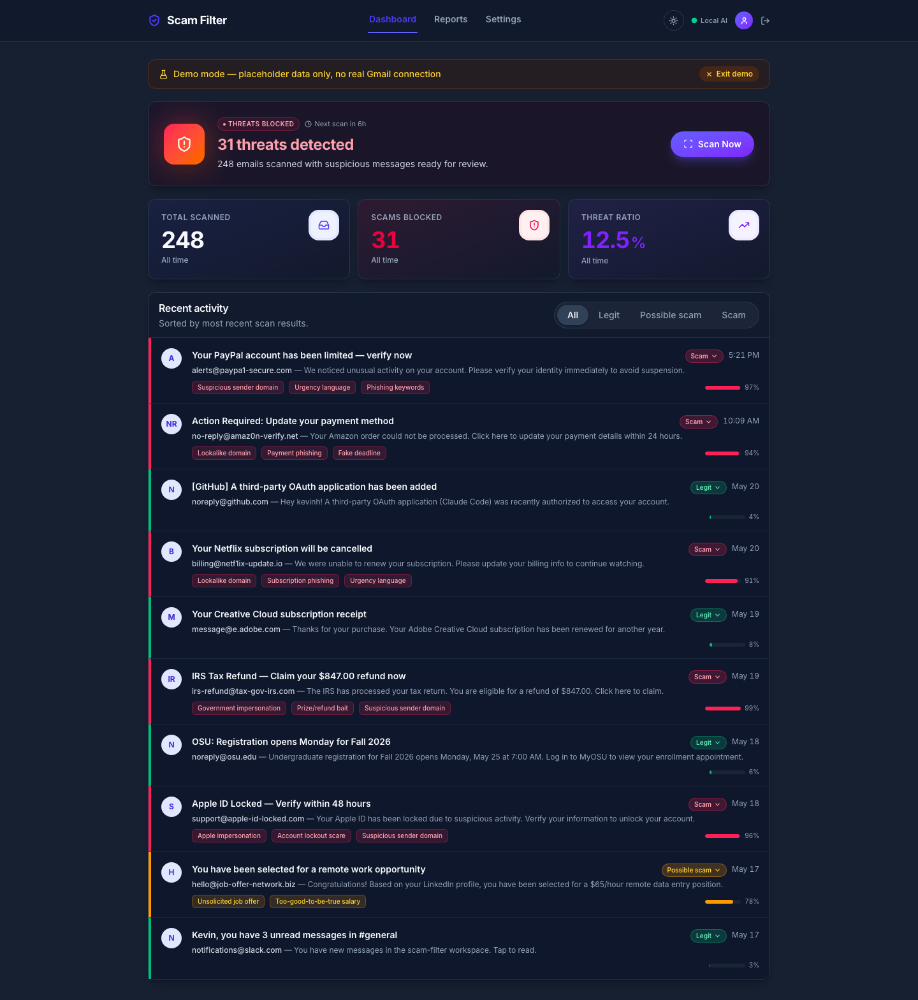
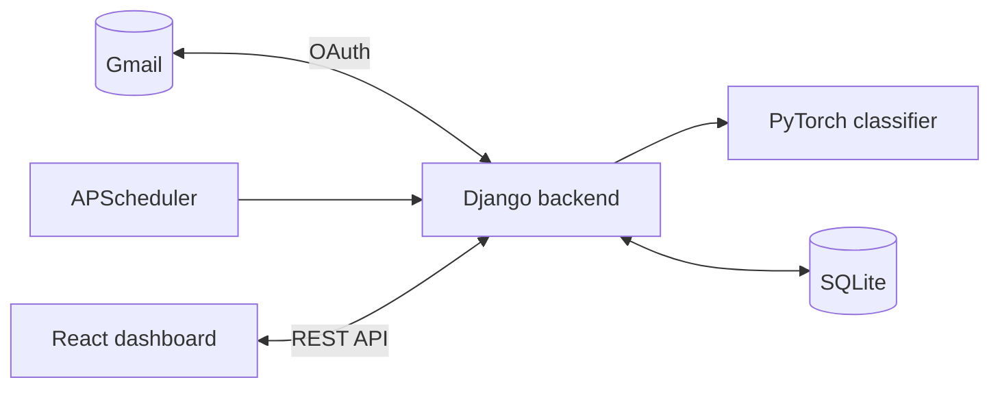
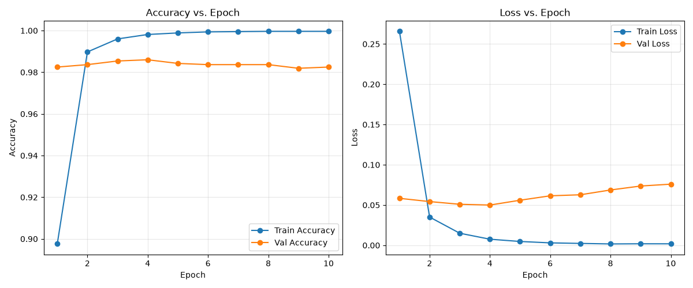

# Scam Email Filter

A self-hosted Gmail scam detector. A PyTorch classifier scores incoming email, flags likely scams, and applies a Gmail label automatically. A React dashboard handles review, correction, and reporting.



## Why

Scam and phishing emails are well documented, and the people targeted are often the least equipped to spot the warning signs. Watching the movie The Beekeeper made this click for me: it showed how a single scam email can snowball into someone losing thousands of dollars, sometimes their entire savings. That's what pushed me to build a personal email filter that catches potential scam and phishing emails without needing to be an expert in spotting fraud.

## Features

- Automatic background scanning of the user's connected Gmail inbox at a configurable interval
- ML-based scam classification (PyTorch neural network, trained on labeled email data)
- Three risk labels (`Legit` / `Possible scam` / `Scam`) with rule-based explanations, e.g. "Urgency tactic," "Lookalike domain"
- Automatic Gmail labeling of confirmed scams
- Manual risk correction, with human correction
- Daily/weekly/monthly summary reports, optionally emailed on a schedule
- A dashboard for scan activity, trends, and per-email review

## How it works


```mermaid
flowchart LR
    Gmail[("Gmail")] <-->|OAuth| Django["Django backend"]
    Django --> ML["PyTorch classifier"]
    Django <--> DB[("SQLite")]
    Scheduler["APScheduler"] --> Django
    React["React dashboard"] <-->|REST API| Django
```

On a schedule (or on demand), the backend fetches new Gmail messages, classifies each with the trained model, and resolves a risk tier. Confirmed scams get a Gmail label applied automatically. The React dashboard reads the same data through a REST API.

A detailed technical walkthrough can be found in [`docs/technical/`](docs/technical/00-architecture.md). 

## Tech stack

| Layer | Technology |
|---|---|
| ML model | PyTorch, scikit-learn (TF-IDF) |
| Backend | Django, Django REST Framework |
| Database | SQLite |
| Email access | Gmail API, OAuth 2.0 + PKCE |
| Scheduling | APScheduler |
| Frontend | React, Vite, Tailwind CSS |

## Setup

### Backend setup

Create a Python virtual environment and install the backend dependencies:

```bash
python -m venv venv
venv/bin/pip install -r requirements.txt
```

Create a `.env` file using `.env.example` as a template. The `.env` file stores local settings such as the Django secret key, allowed hosts, CORS origins, and Gmail OAuth credentials.

Run database migrations:

```bash
venv/bin/python manage.py migrate
```

Start the Django backend:

```bash
venv/bin/python manage.py runserver
```

The development server also starts the background scheduler automatically. In production, either run the scheduler as its own dedicated process (`python manage.py run_scheduler`) or set `SCAM_FILTER_AUTO_START_SCHEDULER=true` on a single designated worker. 

### Frontend setup

```bash
cd frontend
npm install
npm run dev
```

### ML artifacts

The app needs both trained ML artifacts before scans can run:

- `ml/model.pt`
- `ml/vectorizer.json`

Generate them by running the training script:

```bash
venv/bin/python -m ml.train
```

Training also writes `ml/training_history.json` (per-epoch loss/accuracy), which `python -m ml.plot_history` turns into a chart:



### Email reports (optional)

To send scheduled summary emails instead of just printing them to the console, add to `.env`:

```
EMAIL_BACKEND=django.core.mail.backends.smtp.EmailBackend
EMAIL_HOST=smtp.gmail.com
EMAIL_PORT=587
EMAIL_USE_TLS=True
EMAIL_HOST_USER=your-address@gmail.com
EMAIL_HOST_PASSWORD=your-16-char-app-password
EMAIL_FROM=your-address@gmail.com
```

The default `EMAIL_BACKEND` prints emails to the terminal, so no SMTP configuration is required for local development. To test delivery immediately: `python manage.py generate_report` (add `--dry-run` to preview without sending).

## API reference

| Endpoint | Description |
|---|---|
| `GET /api/health/` | Backend health check |
| `GET /api/emails/` | Scanned emails; `?risk_level=scam` filters by tier |
| `PATCH /api/emails/<id>/risk/` | Save a manual risk correction |
| `GET /api/settings/` | Current settings + Gmail connection status |
| `PATCH /api/settings/` | Update settings |
| `GET /api/reports/` | Summary reports; `?period=daily\|weekly\|monthly` |
| `POST /api/scan/` | Trigger an on-demand scan |
| `GET /api/stats/` | Dashboard totals |
| `GET /api/stats/daily/` | Daily scan/scam counts, last 7 days |
| `GET /api/stats/senders/` | Most impersonated domain, highest-risk sender, trend |

Most endpoints require Django session authentication.

## Limitations and roadmap

This is a single-user, self-hosted tool, and several design choices reflect that scope directly: SQLite over a client-server database, in-process scheduling over a dedicated task queue, and risk classification computed at read time rather than denormalized. The full breakdown of current constraints and what changing scope would require is in [`docs/technical/07-limitations.md`](docs/technical/07-limitations.md).

## Security notes

The backend uses authenticated API endpoints, CSRF protection on unsafe requests, configured CORS origins, and safe artifact loading to avoid unsafe deserialization at runtime: the vectorizer is stored as JSON instead of pickle, and the PyTorch model is loaded with `weights_only=True` to reject anything but plain tensors. OAuth uses PKCE and a validated redirect-origin allowlist. Details in [`docs/technical/04-gmail-oauth.md`](docs/technical/04-gmail-oauth.md).

## License

MIT. See [LICENSE](LICENSE).
