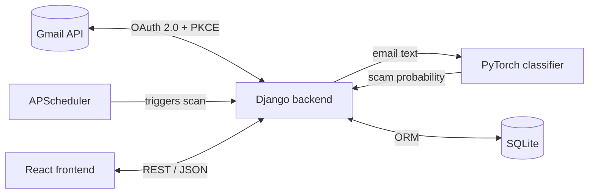
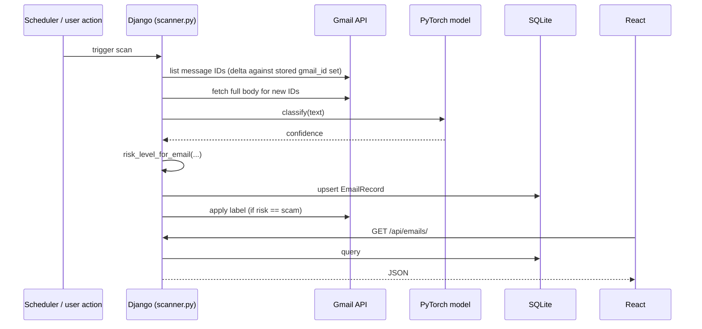

# Architecture

## System overview

The system is a single-user, self-hosted application: one Django process, one SQLite file, one React SPA. There is no message queue, no separate worker service, and no multi-tenancy — the scheduler runs in-process via APScheduler rather than a dedicated task runner (see [05-scheduler-reports.md](05-scheduler-reports.md) for the trade-off).

## Request/data flow

## Module boundaries

| Module | Responsibility | Depends on |
|---|---|---|
| `ml/` | Feature extraction (TF-IDF), model definition, training, inference | scikit-learn, PyTorch |
| `gmail/` | OAuth, message fetch, label management | Google API client |
| `dashboard/` | Models, REST API, scan orchestration, risk classification, scheduler, reports | `ml/`, `gmail/`, DRF |
| `core/` | Django settings, URL root, WSGI/ASGI entrypoints | — |
| `frontend/` | React SPA | `dashboard` REST API |

`dashboard/scanner.py` is the integration point between `gmail/` and `ml/` — it is the only module that imports from both, by design, so neither subsystem depends on the other directly.

## Why this shape

The Gmail-facing code (`gmail/`) and the ML code (`ml/`) are both usable independently of Django — `ml/predict.py` and `gmail/fetch.py` can be run from the command line with no web server involved. This was a deliberate boundary: the ML pipeline is trained and evaluated offline (`python -m ml.train`), and the Gmail client can be exercised in isolation for debugging OAuth issues, without booting the full application.

## See also

- [01-ml-model.md](01-ml-model.md) — classifier architecture and training pipeline
- [02-django-backend.md](02-django-backend.md) — data model and API
- [03-scanning-and-risk.md](03-scanning-and-risk.md) — scan orchestration and risk classification
- [04-gmail-oauth.md](04-gmail-oauth.md) — OAuth/PKCE implementation
- [05-scheduler-reports.md](05-scheduler-reports.md) — background jobs, locking, circuit breaker
- [06-frontend.md](06-frontend.md) — React application structure
- [07-limitations.md](07-limitations.md) — known constraints and scaling boundaries
