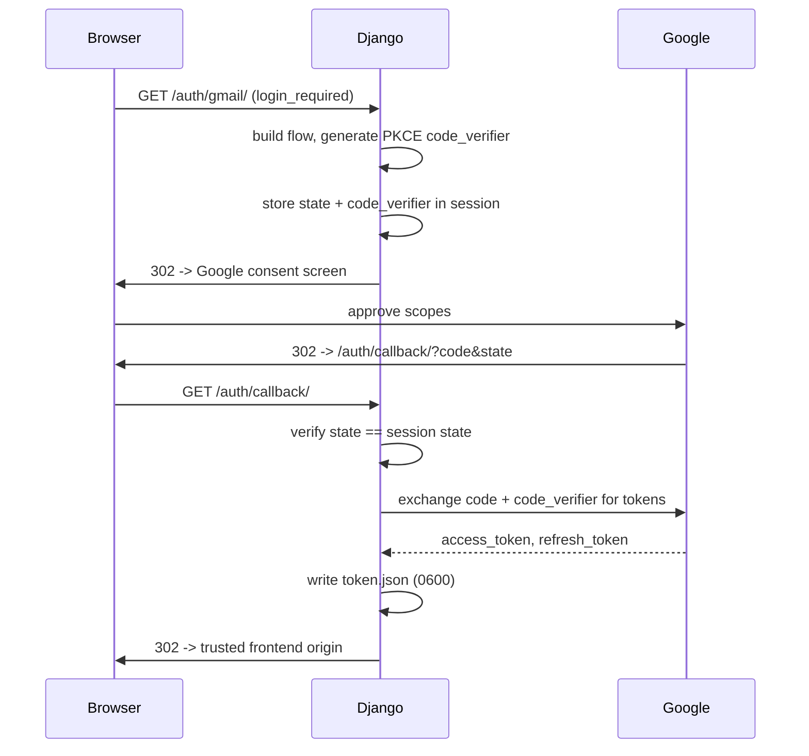

# Gmail OAuth

## Flow

Scopes requested: `gmail.readonly`, `gmail.labels`, `gmail.modify`. No `send` or `delete` scope — deliberately minimal for the feature set.

## PKCE

`_build_flow(..., autogenerate_code_verifier=True)` generates a `code_verifier` kept server-side in the session and never exposed to the browser or to Google until the token-exchange step. This mitigates authorization-code interception: possession of the code alone is insufficient to complete the exchange without the matching verifier.

## CSRF protection on the OAuth callback

`state` is generated per-flow and compared against the session-stored value in `oauth_callback`; a missing or mismatched `state` is rejected with 400 before any token exchange is attempted. This is separate from Django's `CsrfViewMiddleware`, which does not apply to this cross-site redirect flow.

## Token storage and refresh

`token.json` is written with `os.open(..., 0o600)` and re-`chmod`'d defensively on every load. `get_credentials()` transparently refreshes an expired access token via the stored refresh token (`creds.refresh(Request())`), rewriting the file; a failed refresh (revoked access) returns `None` rather than raising, and the app treats this as "Gmail not connected."

## Redirect-origin allowlisting

The post-OAuth redirect destination is resolved from `_allowed_frontend_origins()` — the intersection of `CORS_ALLOWED_ORIGINS` and `FRONTEND_ORIGIN` — never from a request parameter. The trusted origin is captured from the `Origin`/`Referer` header (validated against the allowlist) at flow start and persisted in the session, then read back at callback time. This closes an open-redirect vector: an attacker cannot supply an arbitrary post-auth redirect target via the callback URL.

## Message retrieval (`gmail/fetch.py`)

Two-phase list/get pattern: `list_email_ids()` (IDs only, cheap) is used by the scan path to diff against stored records before paying for a full `messages.get(format="full")` per new message. Body extraction walks Gmail's MIME part tree recursively, preferring `text/plain`, falling back to a minimal HTML-to-text extraction (`_HTMLTextExtractor`) for `text/html`-only messages.

## Label management (`gmail/labels.py`)

`get_or_create_label()` resolves a human-readable label name to Gmail's internal label ID, creating it if absent — no manual Gmail configuration is required before first use.

## See also

- [00-architecture.md](00-architecture.md)
- [07-limitations.md](07-limitations.md) — token storage and retry/backoff gaps
